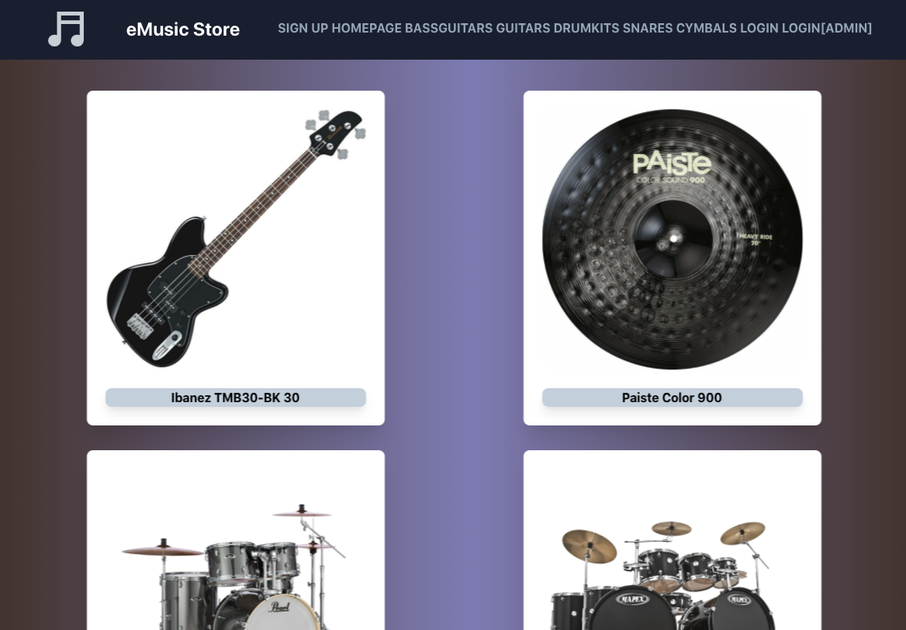
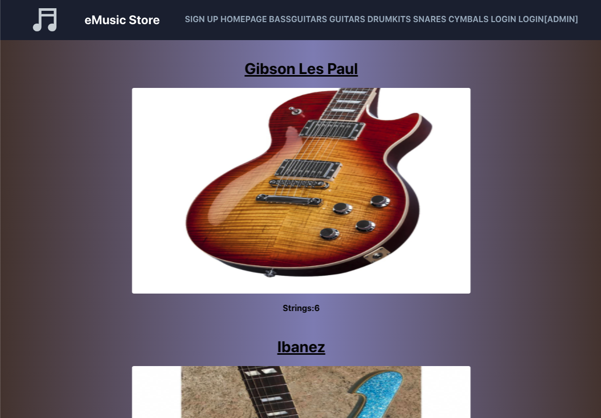
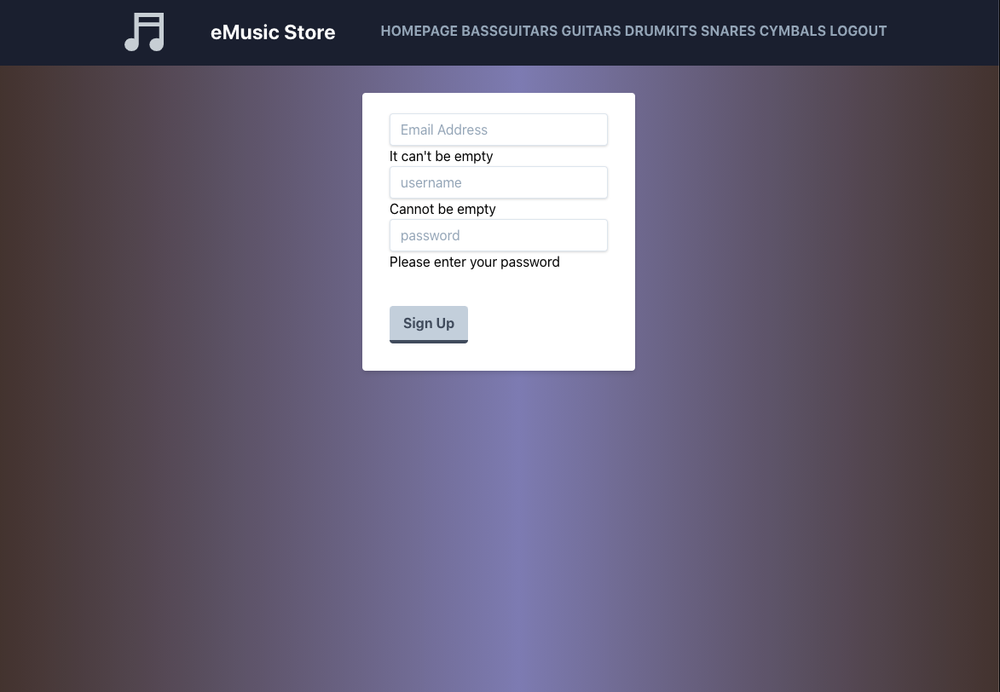

# React & Redux - Front-end / eMusic Store

In this project, you can see the front-end side of my application using React & Redux. There are validations when creating a new user. Also, an admin user exists who is able to see some extra links in the navbar, providing him/her the ability to create new instruments. As a guest user without an account, you can see visit every page and see the instruments. Users who have an account thoug, they have the option to pick their favorite instruments and see them as favorites next time they log in. There are 5 different categories of instruments saved in the API and a generic link in the navbar showing all the instruments stored in the API. Every category has its own individual url in which you can see more information about the each instrument. I'm using Framer Motion package for animating elements on my application. For the images, I'm using Firebase for storing them. Below, you can find the link to the back-end Rails API repository. The Readme file there has details about the back-end project.

This repository is used for the front-end part of my application.

# BUILD WITH

- ReactJS
- Redux
- React-Redux
- Firebase
- Tailwind
- React Hooks
- Redux/Toolkit
- Axios
- Formik
- Yup
- Chokidar-cli
- Framer Motion
- Npm-Run-All
- React/Icons
- React Router Dom
- Uuid
- Prettier
- Eslint

# Back-End Rails API

[GitHub Repo](https://github.com/mariosknl/music_store_api)

# Live Version

[Live Link](https://emusicstore.netlify.app/)

# AUTHOR

- Github: [@mariosknl](https://github.com/mariosknl)
- Twitter: [@mariosknl](https://twitter.com/MariosKnl)
- Linkedln: [marios-kanellopoulos](https://www.linkedin.com/in/marios-kanellopoulos)
- Portfolio: [marios-kanellopoulos](https://marioskanellopoulos.com/)

# Show your support

Give ⭐️ if you like this project!

# Acknowledgments

- Microverse
- [Expedito Andrade](https://github.com/expjazz)

### 🤝 Contributing

Contributions, issues, and feature requests are welcome!
Feel free to check the issues page.
